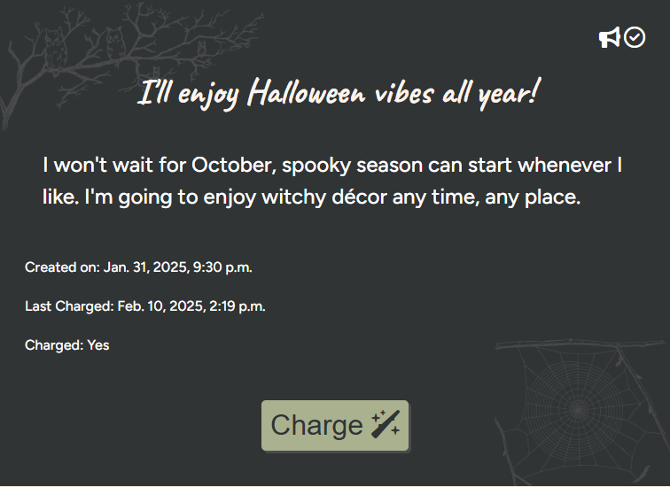

# Manifestation Magic

## Overview

The purpose of Manifestation Magic is to provide users with a dedicated platform to help them manifest their goals, wishes, and dreams. This application aims to address the common challenge of staying motivated and focused on personal aspirations by offering a supportive and structured environment for daily engagement. By allowing users to create, recharge, and track their manifestations, the app encourages consistency, accountability, and positive reinforcement, ultimately helping users achieve their full potential and turn their dreams into reality.

View the live site here: [Manifestation Magic](https://manifestation-magic-d55b183502af.herokuapp.com/)

---

## CONTENTS

* [User Experience](#user-experience-ux)
  * [User Stories](#user-stories)

* [Agile](#agile)

* [Design](#design)
  * [Colour Scheme](#colour-scheme)
  * [Typography](#typography)
  * [Imagery](#imagery)
  * [Wireframes](#wireframes)

* [Features](#features)
  * [General Features on Each Page](#general-features-on-each-page)
  * [Future Implementations](#future-implementations)
  * [Accessibility](#accessibility)

* [Technologies Used](#technologies-used)
  * [Languages Used](#languages-used)
  * [Frameworks, Libraries & Programs Used](#frameworks-libraries--programs-used)

* [AI Implementation and Orchestration](#ai-implementation-and-orchestration)

* [Deployment & Local Development](#deployment--local-development)
  * [Deployment](#deployment)
  * [Local Development](#local-development)
    * [How to Fork](#how-to-fork)
    * [How to Clone](#how-to-clone)

* [Testing](#testing)

* [Credits](#credits)
  * [Code Used](#code-used)
  * [Content](#content)
  * [Media](#media)
  * [Acknowledgments](#acknowledgments)

---

## User Experience (UX)

### User Stories

- Full User Stories in GitHub Projects:
 [GitHub Project board](https://github.com/users/Jo-JPEG/projects/11)

#### Must-have User Stories:
- As a new user, I want to register with the site so that I can access all the features.
- As a returning user, I want to log in with my username and password, so that I can use the site features.
- As a user who uses various devices, I want to securely log out of my account so that my information is kept private and secure.
- As a user, I want to delete my account, so that I can stop using the site or create a new account with different information.
- As a user, I want to update my user account email and password so that I can keep my account secure.
- As a new user, I want to see information about manifesting so that I can create my own manifestation.
- As a new user, I want to create a new manifestation so that I can set my goals and wishes.
- As a returning user, I want to view a list of my manifestations so that I can track my progress.
- As a returning user, I want to edit my manifestations so that I can update my goals and wishes as they evolve.
- As a regular user, I want to delete manifestations so that I can remove goals or wishes that are no longer relevant.
- As a frequent user, I want to recharge my manifestations daily so that I can stay motivated and focused on my goals.
- As a user, I want to set privacy settings for my manifestations so that I can control who can view them.

#### Should-have User stories:
 
- As a user, I want to share my manifestations with friends so that I can get support and encouragement.
- As a community-minded user, I want to see other users' public manifestations so that I can find inspiration and learn from others.

#### Could-have User stories
- As a user, I want to receive inspirational quotes and tips so that I can stay motivated on my journey.
- As a user, I want to categorize my manifestations (e.g., personal, professional) so that I can organize my goals effectively.
- As a frequent user, I want to see notifications for major milestones so that I can celebrate my achievements.
- As an infrequent user, I want to receive email reminders to recharge my manifestations so that I can remember to engage with the site.
- As a user, I want to view my recharge history so that I can see how frequently I have engaged with my goals.

## Agile

For this project I used Agile methodology to prioritize project requirements, tasks, and features.
A [GitHub Project board](https://github.com/users/Jo-JPEG/projects/11) was used for project management. Using this board as a Kanban board helped me to visualize work, limit work in progress (WIP), and optimize workflow.
User stories were separated into 4 catagories:
- Must have: These are the non-negotiable requirements that are essential for the project to be considered successful. Without these features, the project would fail or be deemed incomplete.
- Should have: These are important requirements that are not critical for the project's success but would add significant value. While the project could still function without them, their inclusion would enhance the overall experience.
- Could have: These are desirable requirements that would be nice to have but are not essential. They can be included if time and resources permit, but they are not a priority.
- Won't have (this time): These are requirements that will not be included in the current project scope. They may be considered for future iterations or phases but are not necessary for the current project.

Using the MoSCoW method to prioritize features ensured that I could clearly understand which requirements were most critical and those to be deprioritized.

## Design

### Design Rationale:

### Colour Scheme

 [coolors](https://coolors.co/) was used to generate a calm, high-contrast colour scheme. 

 -

 Additional complimentary colours were generated to provide additional customisation options for users. These colours are seen when certain style choices are selected by the user for their manifestation.

### Typography

Three fonts were selected from [Google Fonts](https://fonts.google.com/).

The main font, Figtree "is a clean yet friendly geometric sans serif font for usage in web and mobile apps". It was chosen as it has a simple, personal feel. Figtree is sans serif meaning it is easier for users with dyslexia or autism to read. 

The secondary font, Caveat, was chosen as it provides a visual distinction from the main font. It is intended to resemble handwriting and gives the site a personal feeling as well as making headings appear distinct. 

The third font, Griffy, is used only to represent the webpage brand, "Manifestation Magic". It has a unique apperance which evokes a feeling of whimsy. This font is used to provide an interesting visual element to the site but is not used for any crucial text.

### Imagery

The logo was designed by myself, taking inspiration from the idea of "manifestation". The logo uses the site colour scheme and was tested with several versions.

Style images were sourced from [pixabay.com](https://pixabay.com/) and used as background images. These images do not provide semantic information and are intended only to enhance the site's aesthetic appeal. Images that would be concidered content should be present in the HTML as an `` so that they can be given alt text.

Style images were used as style choice decorations. All images were edited for size and converted to webp format to ensure best performance. The images were edited to change the colour and transparency as needed to create a cohesive effect and to ensure that all text is clear and has sufficient contrast at all times for easy readability.
Images 

### Wireframes

 [Balsamiq](https://balsamiq.com/) Was used to create wireframes for mobile and desktop views.
 
 - 

 - 
 - 
 - 
 - 

## Features

### Main features

#### Custom User accounts

Users can register, log-in, log-out, edit their passwords and delete their accounts through front-end forms. 

#### Create Manifestation 

Users complete a form to create their own manifestation. This includes a title, description, style choice and if they wish to make the manifestation public.

#### View Manifestation

Each manifestation has a unique URL slug allowing users to view their manifestation. They also have a choice of styles which vary the manifestation's aethetics. The view has information about when the manifestation was created, when it was last charged, it it can be charged now, if it is set to public or private and if it has been approved by an admin.

#### Charge Manifestation

Once a user has created their manifestation, they can recharge it by clicking on a button. Manifestations remain charged for 24 hours, however, users can recharge their manifestation again after 12 hours have passed. This improves the user experience, as users do not have to wait a full 24 hours until they can recharge. This means they do not have to charge at the same time every day but at a time that is convenient for them. 

The idea behind recharging manifestations is that it encourages users to remember their manifestations and goals. The charge button is a statisfying way for users to remain focused on their goals and aspirations.

#### Share Manifestation 

User can choose to make a manifestation public, allowing it to be viewable to others once it has receaved admin approval. This allows users to share thier important goals and wishes as well as take inspiration from other users. The requirement for admin approval ensures that inappropriate or harmful content is not shared publicly. 
If a user edits their public manifestation at any time, it will automatically be resubmitted for admin approval. This ensures that any content that is publicly shared is appropriate for all.

### General features on each page

#### Navigation

As a mobile-first design, Manifestation Magic provides a toggle icon for the navigation menu on screens less than 768 pixels wide. On mobile, the menu has a vertical layout.

On wider screens, a horizontal navigation bar is always visible at the top of the site. 

### Future Implementations

- Future implementations 

### Accessibility

Accessibility was a priority at all stages of developing this project.

I added aria-labels and text context to all elements.

The colour scheme was chosen to meet contrast requirements and also avoid using 100% black and white shades, as this is found to be too harsh for many users.

Fonts were chosen to be dyslexia friendly and provide contrast between main text and headings.

 

## Technologies Used

### Database model

 The database was planned with [dbdiagram.io ](https://dbdiagram.io/).

### Languages Used

- HTML was used to create the frontend pages.
- CSS was used to style the frontend site.
- Python and Django were used to build the backend framework.

### Frameworks, Libraries & Programs Used

- GitHub was used to host the repository and for version control.
- Heroku was used as a platform to host the deployed site.
- [Microsoft Copilot](https://copilot.microsoft.com/) was used (See AI Implementation and Orchestration)
- [FireAlpaca](https://firealpaca.com/) was used for creating the custom logo and editing other images for use on the site.
- [dbdiagram.io ](https://dbdiagram.io/) was used to create a database model.
- [Google Fonts](https://fonts.google.com/) was used for fonts.
- [Font Awesome](https://fontawesome.com/) was used for icons.
- [Favicon.cc](https://www.favicon.cc/) was used to create a favicon.
- [coolors](https://coolors.co/) was used to generate a colour scheme.
- [Balsamiq](https://balsamiq.com/) was used for initial wireframe creation.

## AI Implementation and Orchestration

### Use Cases and Reflections:

#### Code Creation:
- Use of VS Code's integrated Copilot AI allowed for rapid code creation.
- Various adjustments were required for alignment with project goals. 
- Inline prompts for quick code generation or alterations were usually sufficient and required few adjustments.
- VS Code's predictive "ghost text" was also used to speed up repetetive tasks. This frequently required manual adjustments but provided overall time savings.
- Question and Answer style prompts were used to tackle specific coding challenges.

#### Debugging:
- Copilot was helpful in debugging as errors could be copy-pasted and resolved faster than manually scanning code for relevant errors.

#### Performance and UX Optimization:
- AI largly provided clean, optimized code which needed few adjustmnets. However, UX optimization was largely implemented manually through all stages of the project.

### Overall Impact:
- AI tools allowed for faster code creation, enabling focus on high-level development.
- Efficiency gains included .
- Challenges included .
- Copilot removed a vital piece of code while changing the id to slugs.
- On reflection, more specific prompts could have 

## Deployment & Local Development

### Deployment

- **Platform:** 
- The website was deployed to Heroku and can be found [here](https://manifestation-magic-d55b183502af.herokuapp.com/).
### Heroku
* Heroku is a cloud platform that lets developers create, deploy, monitor and manage apps.
- You will need a Heroku account to be able to deploy a website to Heroku.

 **High-Level Deployment Steps:** 
1. From the Heroku dashboard, click 'New' > 'Create new app'
2. Choose a unique name, choose the closest region, and press 'Create app'
3. Navigate to 'Settings' and then click 'Reveal Config Vars'
4. Add a key of 'DISABLE_COLLECTSTATIC' with a value of '1'.
5. Add a key of 'DATABASE_URL' - this value will be the URL for your database.
6. Add a key of 'SECRET_KEY' - the value should be a random secret key.
7. In your terminal, enter the following commands to install project requirements:
- `pip3 install gunicorn~=20.1`
- `pip3 install -r requirements.txt`
- `pip3 freeze --local > requirements.txt`
8. Create a file named `env.py` in the root directory, containing the following:
    - import os
    - os.environ["DATABASE_URL"]='Your database URL'
    - os.environ["SECRET_KEY"]="Your secret key"
9. Create a file at the root directory called Procfile. In this file enter: "web: gunicorn my_project.wsgi" (without the quotes)
10. In settings.py, ensure DEBUG is set to `False`. (Always set debug to false before deploying for security)
11. Add ",'.herokuapp.com' " (without the double quotes) to the ALLOWED_HOSTS list in settings.py
12. Add, commit and push your code.
13. On Heroku, click on the 'Deploy' tab.
14. Connect your project to GitHub.
15. Scroll to 'Manual deploy' and click on, 'Deploy Branch'.

- **Verification and Validation:**
  - Steps taken to verify the deployed version matches the development version in functionality.
  - [Include any additional checks to ensure accessibility of the deployed application.]
- **Security Measures:**
  - Use of environment variables for sensitive data.
  - Ensured DEBUG mode is disabled in production.

### Local Development

#### How to Fork

A fork is a new repository that shares code and visibility settings with the original “upstream” repository.
- To fork a GitHub repository:
1. Login to GitHub and navigate to the repository you want to fork.
2. Click the "Fork" button (found above the Settings button).
3. This creates a copy of the original repository in your GitHub account.

*Once the project is cloned or forked, in order to run it locally, you'll need to follow these steps:

- Run the server: `python3 manage.py runserver`
- Stop the app once it's loaded: `CTRL+C` or `⌘+C`
- Make any necessary migrations: `python3 manage.py makemigrations`
- Migrate the data to the database: `python3 manage.py migrate`
- Create a superuser: `python3 manage.py createsuperuser`

#### How to Clone

Cloning this repository will create a local copy on your computer.

- Access the repository: Go to the GitHub repository you want to clone on the GitHub website. 
- Copy the URL: Click on the "Code" button and copy the HTTPS URL provided. 
- Open your terminal: Open a terminal window on your computer. 
- Run the clone command: `git clone <repository-url>` 
- You can also clone a repository using the GitHub Desktop application by selecting the repository and clicking "Clone". 

## Testing

- Please see [testing.md](testing.md) file for full testing documentation.

### Manual Testing:

#### Devices and Browsers Tested: 
- The site was tested on Chrome, Microsoft Edge, and Opera browsers.
- Various devices were used during testing. Including mobile (Moto G power), laptop and desktop computer. 
- Keyboard navigation was tested to ensure site can be navigated fully without mouse inputs.
#### Features Tested:
- User account creation, login, password edit, logout and account deletion.
- Manifestation creation, view, edit and deletion.
- User navigation was tested to ensure working links throughout.
#### Results:
- All critical features work as expected, including accessibility checks, HTML validation, CSS validation, and Lighthouse performance.
- See [testing.md](testing.md)

## Credits

### Code Used

- I refered to [Code Institute's](https://learn.codeinstitute.net/) Love Running walkthrough for the Navbar toggle code.
- [Code Institute's](https://learn.codeinstitute.net/) I think Therefore I Blog walkthrough was used as a reference during all stages of this project.

### Content

- Site content was written by myself with additions generated by Copilot.

###  Media

- [pixabay.com](https://pixabay.com/) was used to source additional images.
- The logo image was created digitally by myself using drawing program; [FireAlpaca](https://firealpaca.com/).
- [User GDJ on Pixabay](https://pixabay.com/users/gdj-1086657/) has uploaded a wide selection of images which were edited and used as background images for several style choices.
- [Google Fonts](https://fonts.google.com/)
- [Favicon.cc](https://www.favicon.cc/) was used to create a favicon based on the logo.
- [coolors](https://coolors.co/) was used to create a colour scheme.
- [Balsamiq](https://balsamiq.com/) was used to create wireframe images.
- [compress-or-die](https://compress-or-die.com/) was used to convert all images to webp format.
- [amiresponsive](https://ui.dev/amiresponsive) was used to create images showing the site on different devices.

###  Acknowledgments

- Huge thanks to my course facilitator, Emma for all the guidence and support throughout.
- Everyone at Code Institute, especially Roo, John, and Spencer for all their help.
- Thanks to my friends, Reiko, Mike and Elijah for testing the deployed site and providing user feedback.