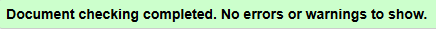
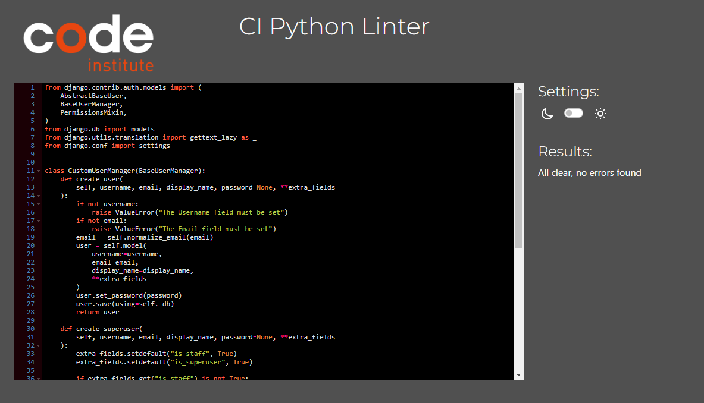
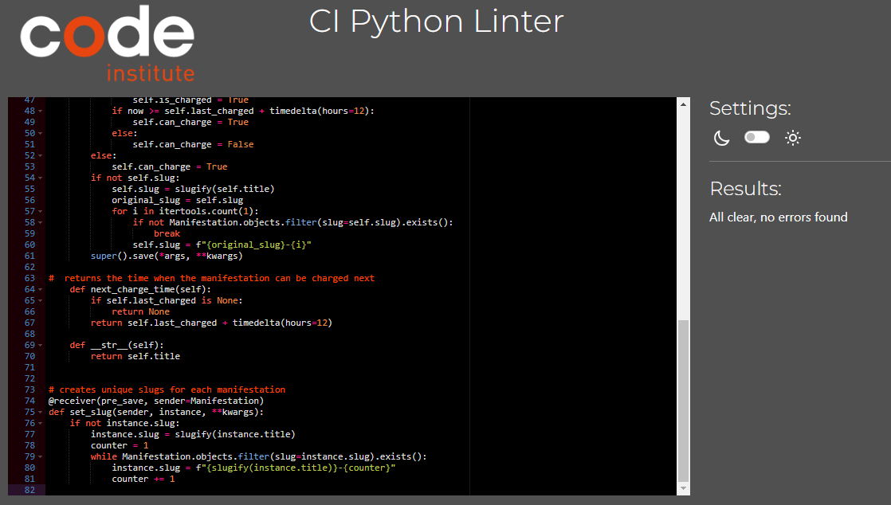
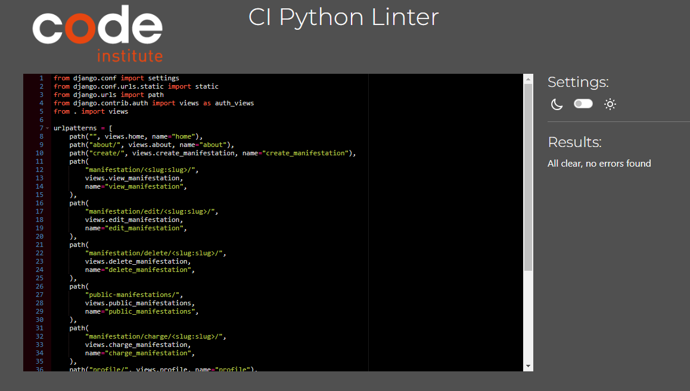
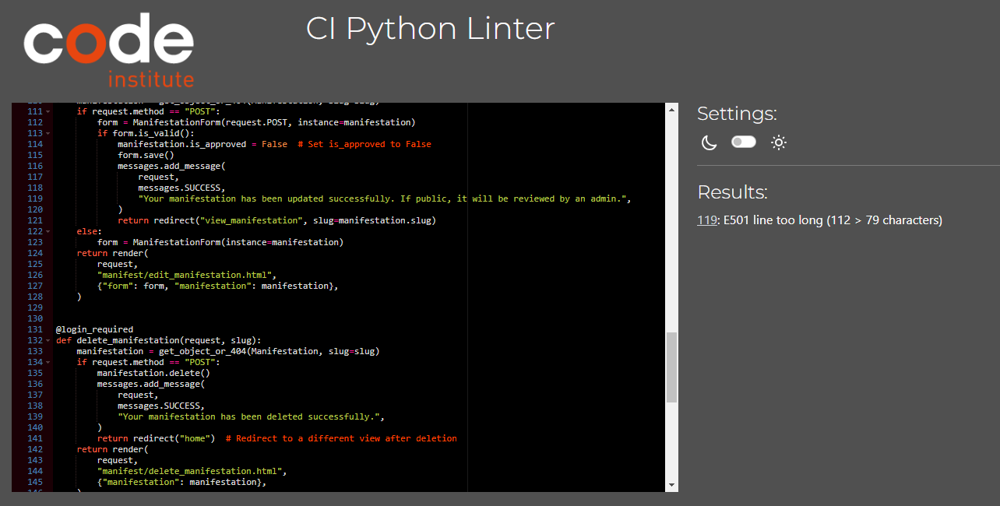
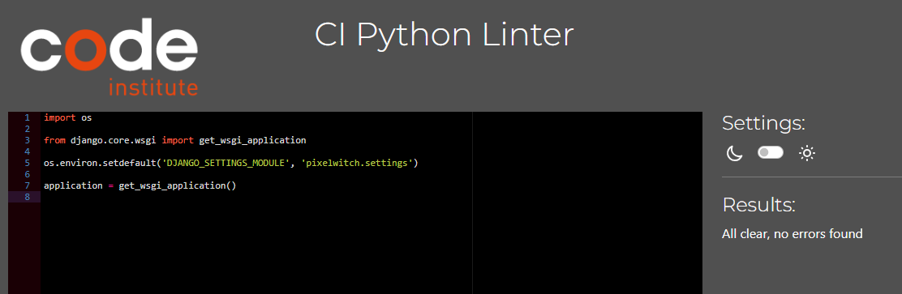
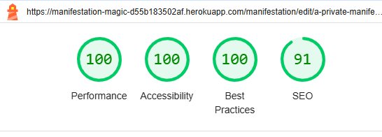
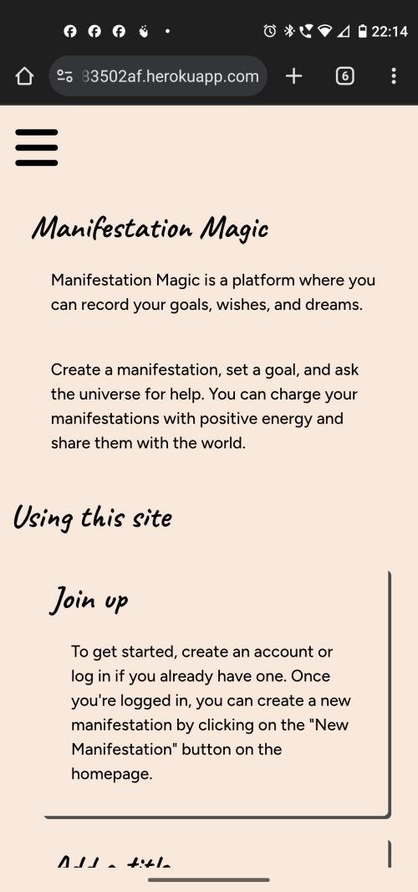
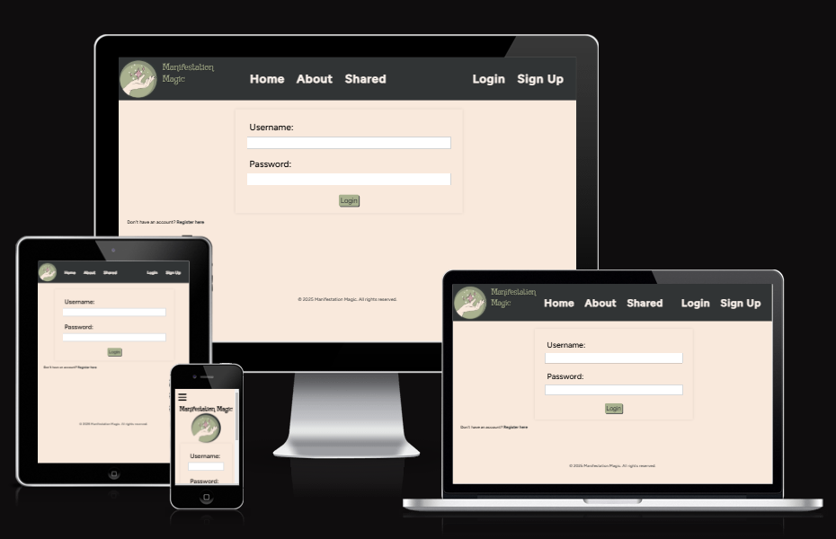

# Testing

## Manual Testing

- Manual testing was carried out on the local and deployed sites.
- The following features were tested during development on both the local and fully deployed site.

|        Location       |           Feature          |                                                                                                           Expected Outcome                                                                                                          | Pass/Fail |                                                                    Notes                                                                   |
|:---------------------:|:--------------------------:|:-----------------------------------------------------------------------------------------------------------------------------------------------------------------------------------------------------------------------------------:|:---------:|:------------------------------------------------------------------------------------------------------------------------------------------:|
| Header                | Home button                | Takes user to home page on click                                                                                                                                                                                                    | PASS      |                                                                                                                                            |
| Header                | Log-in button              | Takes user to log-in page on click                                                                                                                                                                                                  | PASS      | If user is not logged in, the register and log-in buttons will be displayed but if they are logged in, only the log-out button will appear |
| Header                | Register button            | Takes user to registration page on click                                                                                                                                                                                            | PASS      |                                                                                                                                            |
| Header                | Logout button              | Logs out user on click, displays "successfully logged out" message                                                                                                                                                                  | PASS      |                                                                                                                                            |
| Header                | about button               | Takes user to about page on click                                                                                                                                                                                                   | PASS      |                                                                                                                                            |
| Header                | shared button              | Takes user to shared maniestations page on click                                                                                                                                                                                    | PASS      |                                                                                                                                            |
| Header                | profile button             | Takes user to profile page on click                                                                                                                                                                                                 | PASS      |                                                                                                                                            |
| Log-in page           | Log-in function            | When user enters an unknown username, the user will not be logged in                                                                                                                                                                | PASS      |                                                                                                                                            |
| Log-in page           | Log-in function            | When user enters an unknown password, the user will not be logged in                                                                                                                                                                | PASS      |                                                                                                                                            |
| Log-in page           | Log-in function            | When user enters a known username AND password, the user will be logged in                                                                                                                                                          | PASS      |                                                                                                                                            |
| Register page         | Register function          | If user does not enter information into any of the fields, they will be prompted to fill in the field                                                                                                                               | PASS      |                                                                                                                                            |
| Register page         | Register function          | If user does not enter a password which fits the criteria, will not be registered                                                                                                                                                   | PASS      |                                                                                                                                            |
| Register page         | Register function          | If user does not enter a matching password into the password (again) box, they will not be registered                                                                                                                               | PASS      |                                                                                                                                            |
| Register page         | Register function          | If user enters appropriate details, they will be registered                                                                                                                                                                         | PASS      |                                                                                                                                            |
| Logout page           | Sign out button            | Signs user out on click                                                                                                                                                                                                             | PASS      |                                                                                                                                            |
| Home page             | New manifestation button   | Takes user to form to create new manifestation                                                                                                                                                                                      | PASS      |                                                                                                                                            |
| Home page             | Manifestation link         | If user has a previously created a manifestations, the manifestation wil be listed on the home page with a link to view the manifestation in full                                                                                   | PASS      |                                                                                                                                            |
| Home page             | Manifestation Status       | Icons to indicate manifestation is_charged status, is_public, and is_approved are shown for each manifestation                                                                                                                      | PASS      |                                                                                                                                            |
| Create manifestation  | Create new manifestation   | If user fills out forms correctly, a new manifestation will be created with a unique slug url                                                                                                                                       | PASS      |                                                                                                                                            |
| View manifestation    | Charge manifestation       | If user is the owner of the manifestation, they can click to charge their manifestation for 24 hours                                                                                                                                | PASS      |                                                                                                                                            |
| View manifestation    | Edit manifestation         | Takes user to edit_manifestation on click                                                                                                                                                                                           | PASS      |                                                                                                                                            |
| View manifestation    | Delete manifestation       | Takes user to delete_manifestation view on click                                                                                                                                                                                    | PASS      |                                                                                                                                            |
| View manifestation    | Back to home button        | Takes user to Home page on click                                                                                                                                                                                                    | PASS      |                                                                                                                                            |
| View manifestation    | can_charge status          | If user is the owner of the manifestation and 12 hours has passed since the manifestation was charged, the user can click "charge" button to charge the manifestation for a futher 24 hours                                         | PASS      |                                                                                                                                            |
| View manifestation    | can_charge status          | If user is the owner of the manifestation and 12 hours have not passed since the manifestation was last charged, the "charge" button is not visible and a time is displayed to show when the charge function will next be available | PASS      |                                                                                                                                            |
| Shared Manifestations | Public manifestations list | If a manfestation has been set to is_public and has been approved by an administrator, the manifestation will be listed and visible to all users.                                                                                   | PASS      |                                                                                                                                            |
| Profile               | Logout button              | Logs out user on click, displays "successfully logged out" message                                                                                                                                                                  | PASS      |                                                                                                                                            |
| Profile               | Change Password Button     | Takes user to change_password view on click                                                                                                                                                                                         | PASS      |                                                                                                                                            |
| Profile               | Delete Account Button      | Takes user to delete_account view on click                                                                                                                                                                                          | PASS      |                                                                                                                                            |
| Delete_manifestation  | "Yes, delete" button       | Deletes chosen manifestation on click, displays "manifestation successfully deleted" message                                                                                                                                        | PASS      |                                                                                                                                            |
| Delete_manifestation  | "Cancel" button            | Returns user to manifestation view on click                                                                                                                                                                                         | PASS      |                                                                                                                                            |
| Edit_manifestation    | Edit manifestation         | If user fills out forms correctly, the manifestation will be updated with the user's changes. Message, 'Your manifestation has been updated successfully. If it is set to public, it will be reviewed by an admin.' is shown.       | PASS      |                                                                                                                                            |
| Edit_manifestation    | "Cancel" button            | Returns user to manifestation view on click                                                                                                                                                                                         | PASS      |                                                                                                                                            |
| Edit_manifestation    | is_approved update         | If a user edits a previously public and approved manifestation, it will be resubmitted for admin approval before it can be viewed by users other than the manifestation owner.                                                      | PASS      |                                                                                                                                            |
| Change_password       | Change password form       | Is user correctly fills out change password form, the user's password is changed and redirects user to success.html                                                                                                                 | PASS      |                                                                                                                                            |
| Delete_account        | Delete user account        | On click, deletes user account, returns user to homepage and displays message, 'Your account has been deleted successfully.'                                                                                                        | PASS      |                                                                                                                                            |
| Delete_account        | "Cancel" button            | Returns user to profile view on click.                                                                                                                                                                                              | PASS      |                                                                                                                                            |

## Code validators
### HTML
- The [W3C Validator](https://validator.w3.org/) was used to validate the HTML.
#### Home
- 

#### Login page
- 

#### Signup page
- 
- This page has errors due to Django's embedded HTML that cannot be edited.

#### Create Manifestation
- 

#### Edit Manifestation
- 

#### Delete Manifestation
- 

#### View Manifestation
- 

#### Public Manifestations
- 

#### Profile
- 

#### Delete Account
- 

#### Edit Password
- 
- This page has errors due to Django's embedded HTML that cannot be edited.

### CSS custom code
- The [W3C CSS Validator](https://jigsaw.w3.org/css-validator/) was used to validate the CSS.
- 

### Python
- The [CI Python Linter](https://pep8ci.herokuapp.com/) was used to validate the Python files.
- account/admin.py
- 
- manifest/admin.py
- 
- account/apps.py
- 
- manifest/apps.py
- 
- account/forms.py
- 
- manifest/forms.py
- 
- account/models.py
- 
- manifest/models.py
- 
- settings.py
- 
- Lines 104, 107, 110, and 113 were considered too long by PEP8. These lines cannot be shortened in a way that improves readability. Even though it shows an error, the app still functions. 
- pixelwitch/urls.py
- 
- manifest/urls.py
- 
- account/urls.py
- 
- account/views.py
- 
- manifest/views.py
- 
- Lines 119 was considered too long by PEP8. These line cannot be shortened in a way that improves readability as it is a message string. Even though error exists, the app still functions. 
- wsgi.py
- 

### Lighthouse
- Chrome Dev tools were used for debugging and page optimization at all stages of development.
- All image files were converted to webp format and made as small as possible as a result of Lighthouse feedback.
- Links were given background colours distinct from the page background and styled to show when they were hovered over. 
#### Home
- 

#### Signup
- 

#### Login
- 

#### About
- 

#### Shared
- 

#### Profile
- 

#### View Manifestation (Pastel Styling)
- 

#### View Manifestation (Witchy Style)
- 

#### Edit Manifestation
- 

#### Delete Manifestation
- 

#### Future improvements based on Lighthouse

- Reduce unused CSS introduced by third-party sourses, such as Font Awesome icons.
- Minify CSS to reduce network payload sizes.

## Responsiveness

The deployed site was tested for responsiveness accross various devices.

#### Mobile 

-Moto g(8) Power was used for screenshots.
- 
- 
- 

#### Login
- 

#### Signup
- 

#### Shared Manifestations
- 

#### View Manifestation
- 

## Browsers
- I use Google Chrome as my browser so all screenshots above are from Google Chrome.
- The site was tested on Microsoft Edge:
- 
- The site was tested on Opera:
- 

## Bugs
- No known bugs are present at time of deployment.
